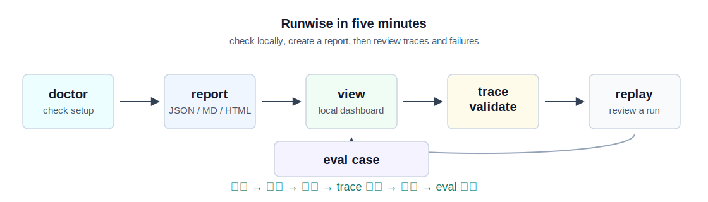

<p align="center">
  
</p>

# Runwise


[English](./README.md) | [中文](./README.zh-CN.md)

Runwise helps you check AI agent projects before they go live.

It runs locally, reviews your project setup, generates reports, validates traces, replays runs, and turns failures into eval cases.

Use it when your AI demo already runs, but you still need to answer:

- Is this project ready to review?
- Are risky tools or MCP servers visible?
- Do we have trace records?
- Can we replay a failed run?
- Can we turn that failure into an eval case?
- Can we share a clear report with a team or client?

**Public preview:** Runwise is source-install only. There is no npm package yet, no GitHub Marketplace release, and no official ecosystem integration or partnership claim. It is local-first, does not upload project data, does not call models, and does not require login.

## Try it in 5 minutes

```bash
git clone https://github.com/darwinx687-afk/runwise.git
cd runwise
pnpm install
pnpm check
pnpm test
pnpm exec runwise doctor
pnpm exec runwise view
```

Generated reports:

```text
.runwise/runwise-report.json
.runwise/runwise-report.md
.runwise/runwise-report.html
```

If your global pnpm behaves differently, use the package manager version declared in `package.json` or enable Corepack.

## What you will see

After running `runwise doctor`, you get:

- a readiness score
- a list of findings
- detected AI project ecosystems
- JSON / Markdown / HTML reports
- a local dashboard view

<p align="center">
  
</p>

For a quick before/after view, see [the visual overview](./assets/runwise-before-after.svg).

## See examples before you run it

Want to understand what Runwise outputs before cloning?

- [Example Gallery](./docs/EXAMPLE_GALLERY.md)
- [Doctor report sample](./docs/demo-output/doctor-report-sample.md)
- [Trace replay sample](./docs/demo-output/trace-replay-sample.md)
- [Failure-to-Eval sample](./docs/demo-output/failure-to-eval-sample.md)

Want to see what the report looks like first?

- [Visual report sample](./docs/demo-output/visual-report-sample.md)
- [Report preview](./assets/report-preview.svg)

## Start here

- [First Run Walkthrough](./docs/FIRST_RUN_WALKTHROUGH.md)
- [Example Gallery](./docs/EXAMPLE_GALLERY.md)
- [Demo Output Samples](./docs/demo-output/README.md)
- [Report Reading Guide](./docs/REPORT_READING_GUIDE.md)
- [English Docs](./docs/en/index.md)
- [Chinese Docs](./docs/zh-CN/index.md)
- [Preview Release](https://github.com/darwinx687-afk/runwise/releases/tag/v0.1.0-preview.0)

## What Runwise does today

| Area | Current capability |
| --- | --- |
| Doctor | Checks workspace shape, package manager state, TypeScript config, governance files, AI indicators, MCP indicators, trace coverage, eval coverage, and ecosystem signals. |
| Reports | Writes JSON, Markdown, and static HTML artifacts under `.runwise/`. |
| View | Opens a local dashboard viewer from `.runwise/runwise-report.json`. |
| Trace validation | Validates local `runwise.agent_trace` files and directories. |
| Trace replay | Builds a static Markdown review of a validated trace. |
| Failure-to-Eval | Generates deterministic JSON/YAML/Markdown eval case drafts from validated traces. |
| Ecosystem detection | Looks for local signals from MCP, RAG, browser agents, Dify-style workflows, Codex-style projects, OpenAI-compatible APIs, and China-ready LLM providers. |

## Commands

```bash
pnpm exec runwise doctor
pnpm exec runwise doctor --cwd . --output .runwise
pnpm exec runwise view
pnpm exec runwise trace validate examples/traces/valid-agent-run.json
pnpm exec runwise trace validate examples/traces
pnpm exec runwise trace replay examples/traces/mcp-risk-agent-run.json
pnpm exec runwise eval generate examples/traces/mcp-risk-agent-run.json
```

Directory trace validation may exit with code `1` if invalid fixtures are included.

## Example projects

Start with [the Example Gallery](./docs/EXAMPLE_GALLERY.md) if you want to see what each example is meant to show.

- `examples/mcp-demo`
- `examples/rag-demo`
- `examples/browser-agent-demo`
- `examples/enterprise-workflow-demo`
- `examples/china-ready-llm-demo`
- `examples/codex-project-demo`
- `examples/traces`

The examples are lightweight fixtures. They do not install real AI frameworks, call external APIs, run models, or execute tools.

## Architecture overview

```text
apps/
  dashboard/                 Local report-file dashboard viewer.
  docs/                      Documentation app shell.
packages/
  cli/                       Runwise command-line interface.
  core/                      Local scanner, rule engine, scoring, trace, replay, and eval generation logic.
  schemas/                   Shared TypeScript schema contracts.
  reporter/                  JSON, YAML, Markdown, and HTML artifact generation.
  integrations/              Local ecosystem profile and detection boundary.
  github-action/             GitHub Action summary and threshold helper.
docs/
  en/                        English Markdown docs.
  zh-CN/                     Simplified Chinese Markdown docs.
```

Runwise does not run your agent, execute tools, upload traces, train models, or store project data in a hosted service.

## Future: local rule packs

Runwise does not support plugins yet. We are exploring a simple local rule-pack design so teams can add their own checks without changing Runwise core.

See: [Plugin Architecture Exploration](./docs/PLUGIN_ARCHITECTURE_EXPLORATION.md)

## Roadmap

- Phase 0-2: Foundation, Doctor CLI, rule engine, and scoring.
- Phase 3-5: Reports, local dashboard viewer, and GitHub Action readiness check.
- Phase 6-8: Trace validation, static replay, and Failure-to-Eval generation.
- Phase 9: Ecosystem compatibility detection and examples.
- Phase 10: Open-source launch polish.
- Phase 11: First-time developer experience, examples, report readability, and future plugin architecture exploration.

See [ROADMAP.md](./ROADMAP.md) and [Next Iteration Plan](./docs/NEXT_ITERATION_PLAN.md).

## Feedback wanted

Runwise is in public preview. Useful feedback includes:

- noisy or missing Doctor findings
- missing AI ecosystem detection signals
- trace schema usability
- replay report clarity
- Failure-to-Eval usefulness
- China-ready LLM provider detection gaps

Please do not include secrets, private customer data, or proprietary traces in public issues.

See [Feedback Guide](./docs/FEEDBACK_GUIDE.md), [Early User Testing Guide](./docs/EARLY_USER_TESTING_GUIDE.md), and [Feedback-to-Roadmap Review](./docs/FEEDBACK_TO_ROADMAP_REVIEW.md).

## Contributing

Read [CONTRIBUTING.md](./CONTRIBUTING.md), [PROJECT_CONSTITUTION.md](./PROJECT_CONSTITUTION.md), and [CODEX_LOOP_PROTOCOL.md](./CODEX_LOOP_PROTOCOL.md) before proposing changes.

## Security

Runwise is local-first and avoids hidden network calls in runtime code. Please read [SECURITY.md](./SECURITY.md) before reporting security issues.

## License

Runwise is released under the [MIT License](./LICENSE).
