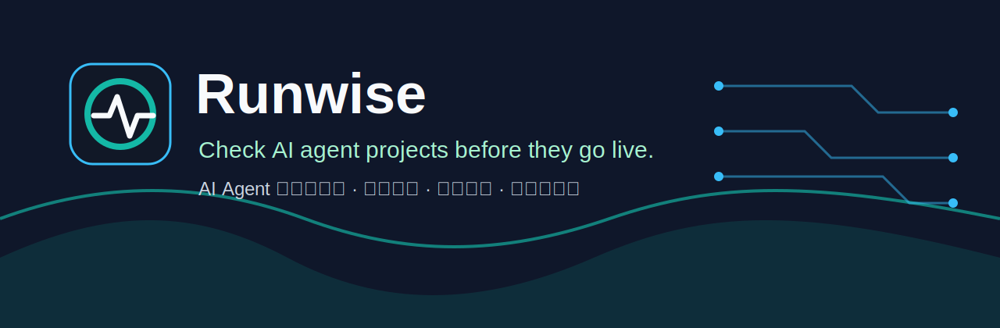

<p align="center">
  
</p>

# Runwise


[English](./README.md) | [中文](./README.zh-CN.md)

Runwise is an open-source readiness, tracing, replay and eval toolkit for AI Agents, MCP servers and LLM applications.

It is built for teams who want local, reviewable evidence before demos, CI gates, and releases. Runwise is not an agent framework, chatbot platform, hosted SaaS, Dify/OpenWebUI clone, Langfuse/Promptfoo replacement, or model training framework.

## Why Runwise

Modern AI applications often fail at the seams between prompts, tools, MCP servers, retrieval, approvals, and deployment assumptions. Runwise helps make those risks visible without sending project data to a hosted service.

- Check local readiness with structured Doctor rules.
- Generate JSON, Markdown, and static HTML reports.
- Validate `runwise.agent_trace` files before replay or eval generation.
- Create static trace replay reports for review.
- Convert failures and risky runs into reusable eval case files.
- Detect local ecosystem signals for common AI project stacks.

## Quick Start

Runwise currently runs from source.

```bash
git clone https://github.com/darwinx687-afk/runwise.git
cd runwise
pnpm install
pnpm check
pnpm test
pnpm exec runwise doctor
pnpm exec runwise view
```

## What Runwise Does

| Area | Current capability |
| --- | --- |
| Doctor | Local readiness checks for workspace shape, package manager state, TypeScript config, governance files, AI indicators, MCP indicators, eval coverage, trace coverage, and ecosystem signals. |
| Reports | JSON, Markdown, and static HTML artifacts under `.runwise/`. |
| Dashboard | Local viewer served from `.runwise/runwise-report.json`. |
| Trace | Local `runwise.agent_trace` validation for files and directories. |
| Replay | Static Markdown replay reports for validated traces. |
| Failure-to-Eval | Deterministic JSON/YAML/Markdown eval case generation from validated traces. |
| Ecosystem detection | Local heuristic profiles for MCP, LangChain, OpenAI Agents, Dify, browser-use, Claude Code, Codex, Cursor, Windsurf, Ollama, OpenAI-compatible APIs, and China-ready LLM providers. |

## Core Workflow

```text
project source
  -> runwise doctor
  -> local report artifacts
  -> trace validation
  -> static replay
  -> Failure-to-Eval cases
  -> CI / review evidence
```

Runwise does not call models, execute tools, run agents, upload traces, train models, or require login.

## Commands

```bash
pnpm exec runwise doctor
pnpm exec runwise doctor --cwd . --output .runwise
pnpm exec runwise view
pnpm exec runwise trace validate examples/traces/valid-agent-run.json
pnpm exec runwise trace validate examples/traces
pnpm exec runwise trace replay examples/traces/mcp-risk-agent-run.json
pnpm exec runwise eval generate examples/traces/mcp-risk-agent-run.json
```

Directory trace validation may exit with code `1` if invalid fixtures are included.

## Reports

`runwise doctor` writes:

```text
.runwise/runwise-report.json
.runwise/runwise-report.md
.runwise/runwise-report.html
```

Static HTML report = shareable artifact generated by doctor.

Local Dashboard Viewer = interactive local viewer served from report JSON.

Generated `.runwise/` files are ignored and should remain reproducible local outputs.

## Local Dashboard Viewer

```bash
pnpm exec runwise view
```

The viewer reads `.runwise/runwise-report.json` locally and does not upload project data.

## GitHub Action

Current local usage:

```yaml
- uses: ./
  with:
    min-score: "70"
    fail-on-blocking: "true"
    fail-on-severity: "critical"
```

Future public usage after the public repository and release tag are created:

```yaml
- uses: <owner>/<repo>@v0
```

Runwise is not claiming GitHub Marketplace availability in this preview.

## Trace Schema

Runwise defines a lightweight local trace format for AI Agent, MCP, RAG and LLM application runs. It records run metadata, model/environment hints, and ordered steps such as LLM calls, tool calls, MCP tool calls, RAG retrieval, approvals, errors, and final output.

```bash
pnpm exec runwise trace validate examples/traces/valid-agent-run.json
```

## Trace Replay

Replay reads a validated trace and explains the timeline, risk points, approval flow, and errors without re-running the agent or calling any model.

```bash
pnpm exec runwise trace replay examples/traces/mcp-risk-agent-run.json
```

## Failure-to-Eval

Runwise can turn a validated trace into reusable eval case files. This helps teams convert real failures, high-risk tool runs, missing approvals, and RAG grounding issues into regression-test assets.

```bash
pnpm exec runwise eval generate examples/traces/mcp-risk-agent-run.json
```

Runwise only generates eval case files. It does not execute evals or call any model.

## Ecosystem Compatibility

Runwise detects local signals for common AI project ecosystems such as MCP, LangChain, OpenAI Agents, Dify, browser-use, Claude Code, Codex, Cursor, Windsurf, Ollama, OpenAI-compatible APIs, and China-ready LLM providers.

Detection is local and heuristic. Runwise does not execute these frameworks or send data anywhere, and it does not claim official partnerships with ecosystem vendors.

## China-Ready / Global-Ready Notes

Runwise can detect placeholder signals such as `OPENAI_BASE_URL`, OpenAI-compatible API usage, Ollama, DashScope/Qwen, DeepSeek, Moonshot/Kimi, Zhipu/GLM, Minimax, Baichuan, and SiliconFlow.

Use these findings to document provider base URLs, model names, data boundaries, rate limits, and fallback behavior before deployment.

## Example Projects

See [examples/README.md](./examples/README.md).

- `examples/mcp-demo`
- `examples/rag-demo`
- `examples/browser-agent-demo`
- `examples/enterprise-workflow-demo`
- `examples/china-ready-llm-demo`
- `examples/codex-project-demo`
- `examples/traces`

These examples are lightweight compatibility examples and fixtures, not production AI apps.

## Architecture

```text
apps/
  dashboard/                 Local report-file Dashboard Viewer.
  docs/                      Documentation app shell.
packages/
  cli/                       Runwise command-line interface.
  core/                      Local scanner, rule engine, scoring, trace, replay, and eval generation logic.
  schemas/                   Shared TypeScript schema contracts.
  reporter/                  JSON, YAML, Markdown, and HTML artifact generation.
  integrations/              Local ecosystem profile and detection boundary.
  github-action/             GitHub Action summary and threshold helper.
docs/
  en/                        English Markdown docs.
  zh-CN/                     Simplified Chinese Markdown docs.
```

## Roadmap

- Phase 0-2: Foundation, Doctor CLI, rule engine, and scoring.
- Phase 3-5: Reports, local dashboard viewer, and GitHub Action readiness check.
- Phase 6-8: Trace validation, static replay, and Failure-to-Eval generation.
- Phase 9: Ecosystem compatibility detection and examples.
- Phase 10: Open-source launch polish and repository presentation.

See [ROADMAP.md](./ROADMAP.md).

## Feedback Wanted

Runwise is in public preview. We are especially looking for feedback on:

- noisy or missing Doctor findings
- AI ecosystem detection signals
- trace schema usability
- replay report clarity
- Failure-to-Eval usefulness
- China-ready LLM provider detection

Please do not include secrets, private customer data, or proprietary traces in public issues.

## Contributing

Read [CONTRIBUTING.md](./CONTRIBUTING.md), [PROJECT_CONSTITUTION.md](./PROJECT_CONSTITUTION.md), and [CODEX_LOOP_PROTOCOL.md](./CODEX_LOOP_PROTOCOL.md) before proposing changes.

## Security

Runwise is local-first and avoids hidden network calls in runtime code. Please read [SECURITY.md](./SECURITY.md) before reporting security issues.

## License

Runwise is released under the [MIT License](./LICENSE).
