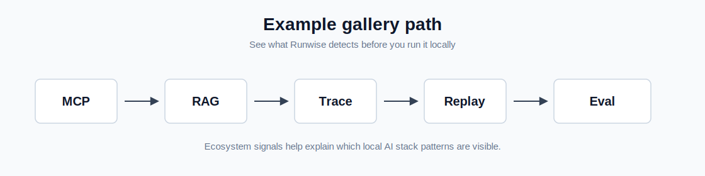
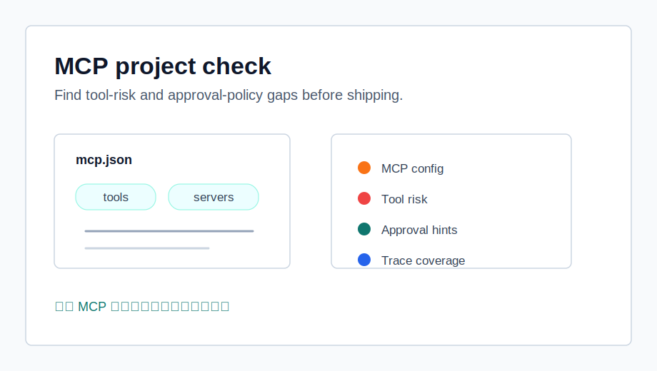
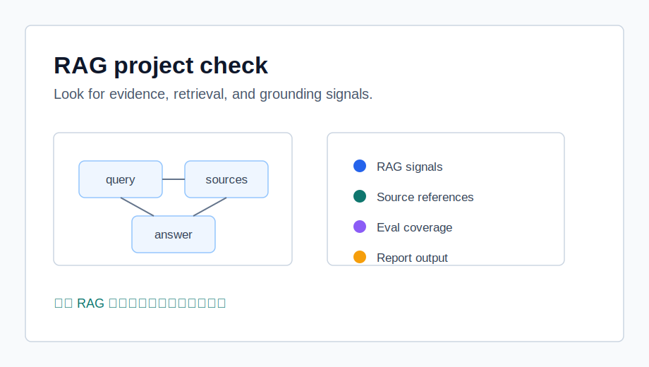
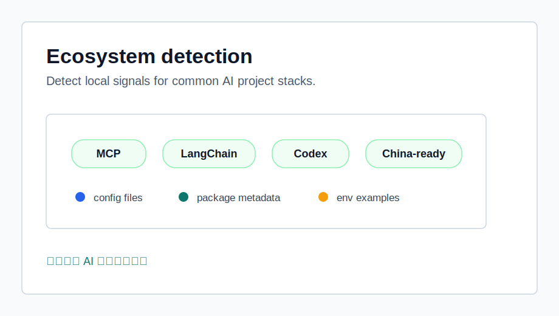
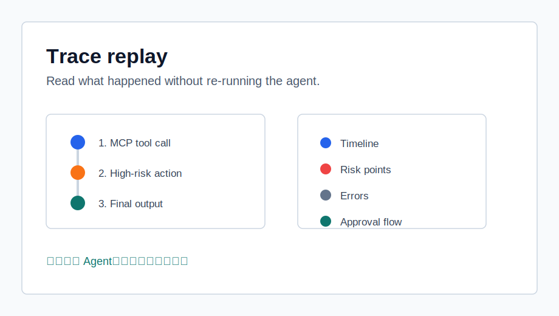
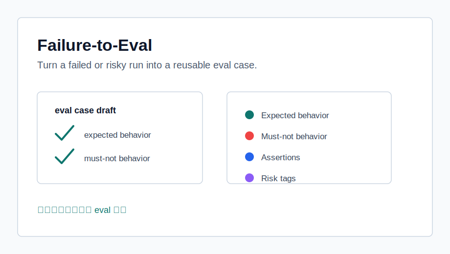

# Example Gallery

Runwise examples are small local fixtures. They show what Doctor, trace validation, replay, Failure-to-Eval, and ecosystem detection can notice without installing real AI frameworks or calling external APIs.

Generated output goes under `.runwise/`, which is ignored by git. The sample links below are curated docs, not generated `.runwise` artifacts.



## MCP demo



This example represents a lightweight MCP-style project with an MCP config and tool approval notes.

What Runwise can detect:

- MCP config detection
- tool-risk hints
- approval-policy recommendations
- trace coverage gaps

Try:

```bash
pnpm exec runwise doctor --cwd examples/mcp-demo --output .runwise/examples/mcp-demo
```

Look for:

- whether MCP usage is visible in the report
- whether high-risk tool findings are understandable
- whether approval guidance is clear enough for a reviewer

Related sample:

- [Doctor report sample](./demo-output/doctor-report-sample.md)

Why it matters:

MCP projects can expose powerful tools. Runwise helps reviewers spot tool-risk and approval-policy gaps before the project is shared or shipped.

## RAG demo



This example represents a retrieval-style project with prompt, trace, and eval placeholders.

What Runwise can detect:

- RAG project signals
- source and evidence documentation hints
- eval coverage placeholders
- report output paths

Try:

```bash
pnpm exec runwise doctor --cwd examples/rag-demo --output .runwise/examples/rag-demo
```

Look for:

- whether retrieval-related files are detected
- whether trace and eval coverage appear in the report
- whether the findings make the next review step obvious

Related sample:

- [Doctor report sample](./demo-output/doctor-report-sample.md)

Why it matters:

RAG work is easier to review when source evidence, trace records, and eval coverage are visible before going live.

## Browser agent demo

This example represents browser-agent style project signals without running a browser automation framework.

Related visual:

- [Ecosystem detection card](../assets/examples/ecosystem-detection-card.svg)

What Runwise can detect:

- browser-agent compatibility notes
- browser-use style package signals
- tool-risk and review documentation hints

Try:

```bash
pnpm exec runwise doctor --cwd examples/browser-agent-demo --output .runwise/examples/browser-agent-demo
```

Look for:

- whether browser automation risk is visible in the report
- whether approval and review boundaries are documented
- whether a reviewer can tell this is a fixture, not a live browser agent

Related sample:

- [Doctor report sample](./demo-output/doctor-report-sample.md)

Why it matters:

Browser agents can touch real accounts, forms, and websites. Reviewers need clear local evidence before any live run.

## Enterprise workflow demo

This example represents Dify-style workflow platform signals and workflow documentation.

Related visual:

- [Ecosystem detection card](../assets/examples/ecosystem-detection-card.svg)

What Runwise can detect:

- workflow platform hints
- configuration placeholders
- review and handoff documentation signals

Try:

```bash
pnpm exec runwise doctor --cwd examples/enterprise-workflow-demo --output .runwise/examples/enterprise-workflow-demo
```

Look for:

- whether workflow-style files are detected
- whether deployment or handoff assumptions are visible
- whether findings help a team review the project before sharing it

Related sample:

- [Ecosystem detection sample](./demo-output/ecosystem-detection-sample.md)

Why it matters:

Workflow projects often need a readable readiness summary for teams and clients, even when the demo already runs.

## China-ready LLM demo



This example shows OpenAI-compatible API and China-ready LLM provider placeholders.

What Runwise can detect:

- `OPENAI_BASE_URL` style configuration
- OpenAI-compatible API hints
- China-ready provider placeholders such as DashScope/Qwen, DeepSeek, Moonshot/Kimi, Zhipu/GLM, Minimax, Baichuan, and SiliconFlow

Try:

```bash
pnpm exec runwise doctor --cwd examples/china-ready-llm-demo --output .runwise/examples/china-ready-llm-demo
```

Look for:

- whether provider signals appear clearly
- whether data boundary and fallback documentation are requested
- whether missing deployment assumptions are easy to spot

Related sample:

- [Ecosystem detection sample](./demo-output/ecosystem-detection-sample.md)

Why it matters:

Many teams need global and China-ready deployment notes before a project can be reviewed seriously.

## Codex project demo

This example represents coding-agent project instruction files and editor-agent hints.

Related visual:

- [Ecosystem detection card](../assets/examples/ecosystem-detection-card.svg)

What Runwise can detect:

- `AGENTS.md` and `CLAUDE.md` style instruction files
- Cursor and Windsurf rule files
- local review and governance signals

Try:

```bash
pnpm exec runwise doctor --cwd examples/codex-project-demo --output .runwise/examples/codex-project-demo
```

Look for:

- whether coding-agent instructions are detected
- whether local review expectations are visible
- whether the report distinguishes project guidance from runtime behavior

Related sample:

- [Ecosystem detection sample](./demo-output/ecosystem-detection-sample.md)

Why it matters:

Coding-agent projects benefit from visible instructions, guardrails, and local review artifacts before contributors start using them.

## Trace fixtures



The trace fixtures show valid, invalid, risky, and error-oriented `runwise.agent_trace` files.

What Runwise can detect:

- trace schema problems
- MCP/tool risk signals
- approvals, errors, and failure notes
- eval case fields generated from a reviewed failure

Try:

```bash
pnpm exec runwise trace validate examples/traces/valid-agent-run.json
pnpm exec runwise trace replay examples/traces/mcp-risk-agent-run.json
pnpm exec runwise eval generate examples/traces/mcp-risk-agent-run.json
```

Look for:

- whether validation messages are understandable
- whether replay explains the run without re-running it
- whether generated eval case drafts are reviewable

Related samples:

- [Trace replay sample](./demo-output/trace-replay-sample.md)
- [Failure-to-Eval sample](./demo-output/failure-to-eval-sample.md)

Why it matters:

Trace files turn one run into evidence that can be checked, replayed, and converted into future eval cases.


