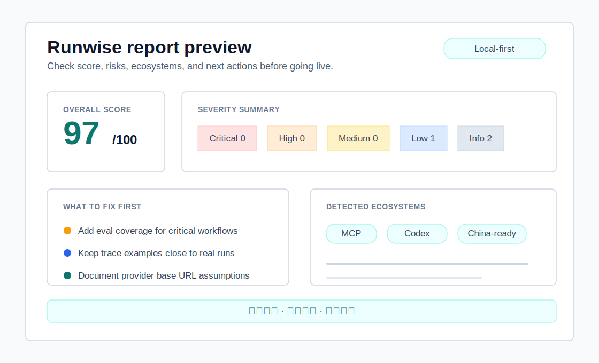

# Visual Report Sample

The static HTML report is the easiest way to share a Runwise result with someone who does not want to run the CLI.

It is generated locally by `runwise doctor`, is self-contained, and can be opened directly in a browser or uploaded as a GitHub Actions artifact.

Start with:

1. Overall score
2. What to fix first
3. Detected ecosystems
4. Medium/high findings
5. Report files

## Static HTML Report vs Local Dashboard

| Surface | Use it when | Notes |
| --- | --- | --- |
| Static HTML report | You want to share a single generated file. | No dev server required. Good for GitHub Actions artifacts or team review. |
| Local dashboard viewer | You want to inspect the report locally. | Reads `.runwise/runwise-report.json` and adds lightweight filtering. |

Both are local-first. Neither uploads project data.

## What Makes a Finding Important

Prioritize findings in this order:

1. Blocking
2. Critical
3. High
4. Medium findings tied to trace, eval, approval, or provider assumptions
5. Low and info findings when you are polishing readiness

## How to Share It

- Run `pnpm exec runwise doctor`.
- Share `.runwise/runwise-report.html` with a teammate.
- Keep `.runwise/` out of git unless you intentionally archive a report artifact elsewhere.
- Convert repeated failures into eval cases when they should become regression checks.

